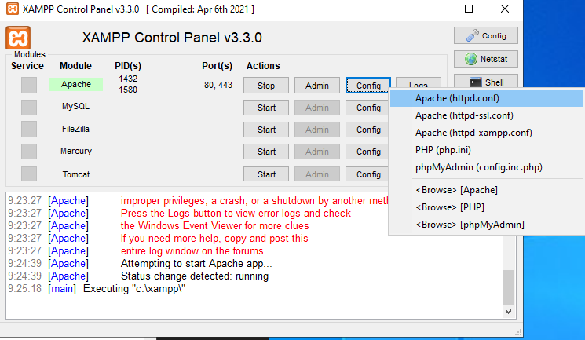

# Školní projekt týmu Dream team
## Vysoká škola polytechnická

### Menu
- [O projektu](#o-projektu)
- [Účastníci](#účastníci)
- [Instalace](#instalace)
  - [Windows](#windows-1011)
  - [Linux](#linux)
- [Vývoj](#vývoj)
  - [Windows](#windows)
  - [Linux](#linux-1)
- [Kontakt](#dotazy)

### O projektu
Teamová práce v PHP, HTML, CSS a MySQL je klíčem k úspěšnému vytvoření webové stránky s články. Tato spolupráce umožňuje vývojářským týmům vytvořit stránku, která je nejen vizuálně atraktivní díky HTML a CSS, ale také dynamickou a funkční díky PHP a MySQL. PHP umožňuje vytvářet interaktivní prvky a zpracovávat data z databáze, zatímco MySQL slouží k ukládání článků a obsahu. Každý člen týmu může přinést své dovednosti a znalosti k vytvoření webové stránky, která je snadno spravovatelná a nabízí uživatelům kvalitní obsah v podobě článků. Spolupráce a komunikace v týmu jsou klíčové pro dosažení vynikajícího výsledku a poskytnutí uživatelům skvělý zážitek z prohlížení webové stránky.


### Účastníci
- Kryštof Malinda
- Ondřej Kohout
- Martin Velc
- Stanislav Čech
- Oliver Kolčák
- Vojtěch Jaroš

### Instalace

_Pro možnost vyvýjení a testovaní tohoto projektu jsou potřeba nasledující věci:_

#### Windows 10/11
Zde si stačí **vybrat** jeden softwarový balíček

- [XAMPP](https://www.apachefriends.org/)
- [WAMP](https://www.wampserver.com/en/)

#### Linux
- [Docker](https://hub.docker.com/_/php)

Nebo nainstalujeme php nebo apache přes **balíčkový systém**:

Zde pak je **anglický** officiální návod od [Canonical (tvůrci Ubuntu)](https://ubuntu.com/tutorials/install-and-configure-apache#1-overview)

**Ubuntu/Debian**
```bash
sudo apt install apache2
```
**Arch Linux a jeho variace**
```bash
sudo pacman -S apache
```

### Vývoj

#### Windows
Pro tento tutorial jsem si vybral [XAMPP](https://www.apachefriends.org/)

1. Stáhneme si [XAMPP](https://www.apachefriends.org/)


2. Vybereme všechny možnosti \


3. Otevřeme si složku XAMPP pomocí toho že klikneme na ikonku **Explorer**


4. Zademe do složky kam jsme nainstalovali XAMPP většinou to je `C:\xampp` a do složky `C:\xampp\htdocs` a tam naklonujeme tento repositář


5. Pak si otevřeme konfiguraci **httpd.conf**


6. Najdeme `DocumentRoot` a upravíme aby to ukazovalo do toho našeho **naklovovaného projektu** do složky **Code**


7. A když otevřeme http://localhost tak mam vidět soubory které můžeme otevřít


#### Linux
1. Nainstalujeme **Docker**

2. Naklonujeme náš projekt
```bash
git clone https://github.com/Lynder063/rsp-dream-team.git
```
3. Vyvtoříme docker image
```bash
docker run -d \
  --name web_server \
  -p 80:80 \
  -v [cesta k /rsp-dream-team/Code]:/var/www/html \
  php:8.2-apache
```
4. Přepneme se do **console** containeru
```bash
docker exec -it web_server /bin/bash
```
5. Přidáme podporu pro DB _(MySQL/MariDB)_
```bash
docker-php-ext-install mysqli pdo pdo_mysql
```
### Dotazy
Ohledně instalace nebo vývoje kontaktujte mě: **Kryštof**a **Malind**u

**Discord**: ``lynder063``


